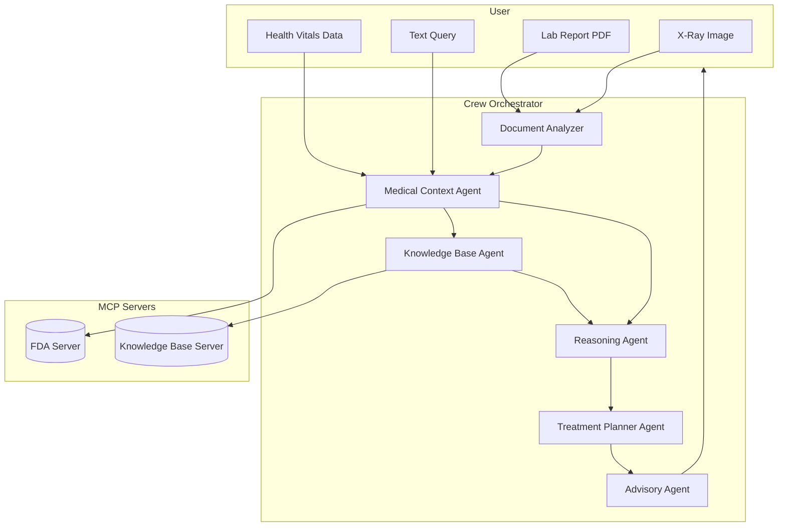

# 🏥 CareCrew — Groq Hackathon Submission  

  
  
  
  

---

## 🚀 Submission Checklist  
- [x] **Demo Video (≤ 3 mins):** [Demo_Link]([https://example.com](https://drive.google.com/file/d/1qevw-eD6HzrsckiROaSUMB0Ylk8X0sR_/view?usp=drive_link))
- [ ] **Live Deployment URL** — *not applicable* (local setup only)  
- [x] **Comprehensive Local Run Steps**  
- [x] **≥2 Specialized Agents** (✅ 6+ agents implemented)  
- [x] **MCP Integration** (FDA + KB servers)  
- [x] **Multimodal Inputs Demonstrated** (PDFs, X-rays, text)  
- [x] **Dependencies Listed** (`requirements.txt`)  
- [x] **Architecture Diagram Included**  
- [x] **Ethics & Safety Considerations**  

---

## 🧩 Problem Statement  
Healthcare professionals must synthesize information from **lab reports, prescriptions, imaging, vitals, and guidelines**. Doing this manually is slow and prone to error.  

---

## 💡 Solution Overview  
**CareCrew** is a **multi-agent healthcare assistant** powered by Groq.  

It:  
- Accepts **multimodal inputs** (PDFs, X-rays, text).  
- Uses **specialized agents** for context extraction, reasoning, and treatment planning.  
- Connects to **MCP servers** for FDA data and knowledge base lookups.  
- Provides **low-latency outputs** using Groq’s hardware acceleration.  

---

## 🏗️ System Architecture  

### 👩‍⚕️ Agents (6+)  
- **Advisory Agent** → synthesizes recommendations.  
- **Medical Context Agent** → interprets patient history.  
- **Treatment Planner Agent** → proposes treatment plans.  
- **Reasoning Agent** → validates outputs.  
- **Knowledge Base Agent** → queries indexed guidelines.  
- **Document Analyzer** → parses PDFs (lab reports, prescriptions).  
- **Crew Tasks & Agent Definitions** → workflow definitions.  

### 🔗 MCP Integration  
- `mcp_server_fda.py` → FDA data reference.  
- `mcp_server_kb.py` → indexed medical knowledge base.  

### 📊 Data Flow (Diagram)  



---

## ⚡ Why Groq?  
- **Near real-time inference** for multimodal inputs.  
- **Handles large contexts** (documents + imaging + vitals).  
- **Low-latency + cost-efficient** for healthcare agent orchestration.  

---

## 🖥️ How to Run Locally  

```bash
# 1. Create environment
python -m venv .venv && source .venv/bin/activate
pip install -r requirements.txt

# 2. Set API keys (example)
export GROQ_API_KEY=your_groq_key_here

# 3. Start MCP servers (separate terminals)
python "CareCrew/mcp_server_fda.py"
python "CareCrew/mcp_server_kb.py"

# 4. Run the app
python "CareCrew/app.py"
```

---

## 🎥 Demo  

- **Video (≤ 3 mins):** [PLACEHOLDER — insert Google Drive link here]  
- **Live Deployment:** *Not applicable (local only)*  

### Sample Workflow  
1. Upload `sample data/lab_report.pdf` and `sample data/x ray 2.webp`.  
2. System parses data → queries MCP servers → agents reason together.  
3. Advisory Agent outputs structured recommendations.  

---

## 📂 Datasets & Modalities  
- **PDFs** → lab reports, prescriptions, treatment guidelines.  
- **Images** → X-ray scans.  
- **CSVs** → patient vitals (`health_vitals`), MTSamples dataset.  
- **Text** → orchestrated prompts & outputs.  

---

## ⚙️ Dependencies  
- Python 3.10 
- `pip install -r requirements.txt`  

---


## 📜 License  
[MIT License](LICENSE)  
