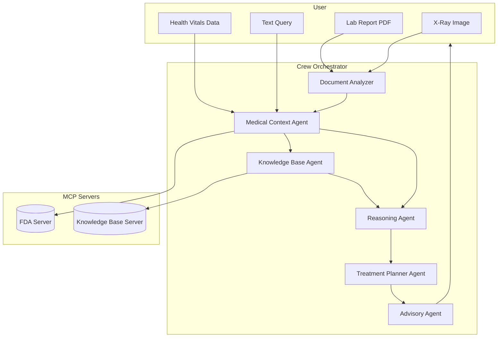

# 🏥 CareCrew — Groq Hackathon Submission  

  
  
  
  

---

## 🚀 Submission Checklist  
- [x] **Demo Video (≤ 3 mins):**  [You can watch the demo video here](https://drive.google.com/file/d/1qevw-eD6HzrsckiROaSUMB0Ylk8X0sR_/view?usp=drive_link).
- [ ] **Live Deployment URL** — *not applicable* (local setup only)  
- [x] **Comprehensive Local Run Steps**  
- [x] **≥2 Specialized Agents** (✅ 6+ agents implemented)  
- [x] **MCP Integration** (FDA + KB servers)  
- [x] **Multimodal Inputs Demonstrated** (PDFs, X-rays, text)  
- [x] **Dependencies Listed** (`requirements.txt`)  
- [x] **Architecture Diagram Included**  
- [x] **Ethics & Safety Considerations**  

---

## 🧩 Problem Statement  
Healthcare professionals deal with a flood of information every day:
- Lab reports (PDFs)
- Prescriptions (text or scanned images)
- Vital signs 
- Long medical guidelines and references
- Medical imaging (X-rays)

Currently, doctors and nurses must manually read, compare, and cross-check these different sources. This process is:

- **Time-consuming** — reading many files slows diagnosis.
- **Error-prone** — important details can be missed or misread.
- **Stressful** — especially during urgent care or high workload.

As a result, patients may face delayed care, miscommunication, or preventable mistakes. CareCrew aims to reduce this burden by automatically extracting, combining, and summarizing multimodal medical data to produce clear, actionable recommendations.  

---

## 💡 Solution Overview  
**CareCrew** is a **multi-agent healthcare assistant** built with **Groq’s fast AI hardware**.  

Instead of doctors manually piecing together lab results, reports, images, and guidelines, **CareCrew automatically does the heavy lifting**.  

**How it works in simple terms:**  
- **Reads medical files** → extracts data from PDFs, prescriptions, X-rays, and vitals.  
- **Understands context** → interprets patient history so numbers make sense.  
- **Checks trusted sources** → queries FDA and medical guidelines through MCP servers.  
- **Suggests next steps** → proposes possible treatments or diagnostic tests.  
- **Explains clearly** → generates an easy-to-read summary for doctors or patients, with optional voice output.  

Because it runs on **Groq**, the system can process large reports, images, and datasets **very quickly**, delivering results in **near real-time** — practical for healthcare teams under pressure.    

---

## 🏗️ System Architecture  

CareCrew uses multiple agents, each with a **specific role**. Think of them like different specialists working together in a hospital team.  

- **Document Analyzer**  
  Reads and extracts information from lab reports, prescriptions, and other medical documents (PDFs, scans, structured text).  
  *Example:* If you upload a blood test, it pulls out numbers like **Glucose: 155 mg/dL**, **Cholesterol: 210 mg/dL** instead of you having to read manually.  

- **Medical Context Agent**  
  Understands the patient’s background (history, conditions, medications) and adds meaning to raw data.  
  *Example:* High glucose may not mean much alone, but if the patient already has **diabetes**, it highlights this as a serious issue.  

- **Reasoning Agent**  
  Double-checks everything, finds connections, and ensures the analysis makes logical sense.  
  *Example:* If glucose is high but no diabetes medication is listed in the prescription, it may raise a flag: *“Check if patient is following treatment.”*  

- **Knowledge Base Agent**  
  Looks up official medical rules and guidelines (via MCP servers) to back up recommendations with trusted sources.  
  *Example:* If cholesterol is high, it retrieves a rule: *“LDL above 190 mg/dL usually requires statin therapy (per WHO/FDA).”*  

- **Treatment Planner Agent**  
  Suggests possible next steps, tests, or treatments, based on both patient data and official guidelines.  
  *Example:* For high glucose, it might suggest an **HbA1c test**, **dietary changes**, or **consulting a physician**.  

- **Advisory Agent**  
  Converts everything into a clear, structured summary that doctors and patients can easily understand.  
  *Example:* Final report might say:  
  - “Glucose is 155 mg/dL (high) → consistent with uncontrolled diabetes.”  
  - “Recommend HbA1c test and physician consultation.”  
  - “Based on WHO guidelines, consider starting or adjusting treatment.”  

--- 

**Together, these agents act like a medical team:**  
- One reads and extracts the data.  
- One interprets patient background.  
- One checks against trusted rules.  
- One validates logic.  
- One plans treatment.  
- One explains everything clearly.  

---

### MCP Integration  

MCP (Model Context Protocol) allows CareCrew to **connect to external data sources** through lightweight servers. This makes the system extensible and trustworthy.  

- **`mcp_server_fda.py` → FDA Data Reference**  
  Provides access to **FDA-approved drugs, side effects, and safety notices**.  
  *Example:* If a prescription includes *Metformin*, the FDA server can provide official dosage ranges and warnings.  

- **`mcp_server_kb.py` → Knowledge Base**  
  Connects to an **indexed database of medical guidelines, research papers, and ICD-10 codes**.  
  *Example:* If the system detects *high blood pressure*, it queries the KB server and finds: *“Stage 2 Hypertension is defined as 140/90 mmHg or higher.”*  

**Why MCP Matters:**  
- Keeps agents lightweight → they don’t need to store everything locally.  
- Ensures outputs are **grounded in verified sources** (like FDA ).  
- Makes it easy to add more servers in the future (e.g., *OCR server for images, Patient History DB, Insurance DB*).  

---


### 📊 Data Flow (Diagram)  



---

## ⚡ Why Groq?  
- **Near real-time inference** for multimodal inputs.  
- **Handles large contexts** (documents + imaging + vitals).  
- **Low-latency + cost-efficient** for healthcare agent orchestration.  

---

## 🖥️ How to Run Locally  

```bash
# 1. Create environment
python -m venv .venv && source .venv/bin/activate
pip install -r requirements.txt

# 2. Set API keys (example)
export GROQ_API_KEY=your_groq_key_here

# 3. Start MCP servers (separate terminals)
python "CareCrew/mcp_server_fda.py"
python "CareCrew/mcp_server_kb.py"

# 4. Run the app
python "CareCrew/app.py"
```

---

## 🎥 Demo  

- **Demo Video:**  [You can watch the demo video here](https://drive.google.com/file/d/1qevw-eD6HzrsckiROaSUMB0Ylk8X0sR_/view?usp=drive_link).
- **Live Deployment:** *Not applicable (local only)*  

### Sample Workflow  
1. Upload `sample data/lab_report.pdf` and `sample data/x ray 2.webp`.  
2. System parses data → queries MCP servers → agents reason together.  
3. Advisory Agent outputs structured recommendations.  

---

## 📂 Datasets & Modalities  
- **PDFs** → lab reports, prescriptions, treatment guidelines.  
- **Images** → X-ray scans.  
- **Text** → orchestrated prompts & outputs.  

---

## ⚙️ Dependencies  
- Python 3.10 
- `pip install -r requirements.txt`  

---


## 📜 License  
[MIT License](LICENSE)  
